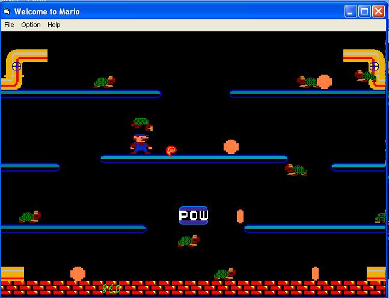



## One \- Two Player 2D Mario Game

### Description

This is a classic 2d mario game with sound, and multiplayer. It uses the windows api functions such as bitblt and playsound. Use arrow keys to move, space to jump, also moves for fireballs and POW box. Bonuses inlude coins, 2 levels, turtles and crabs. Skim thorugh read me for further details.
 
### More Info
 

             |
---                |---
**Submitted On**   |2003-09-06 14:59:30
**By**             |[Bob J Dole](https://github.com/Planet-Source-Code/PSCIndex/blob/master/ByAuthor/bob-j-dole.md)
**Level**          |Advanced
**User Rating**    |4.9 (54 globes from 11 users)
**Compatibility**  |VB 6\.0
**Category**       |[Games](https://github.com/Planet-Source-Code/PSCIndex/blob/master/ByCategory/games__1-38.md)
**World**          |[Visual Basic](https://github.com/Planet-Source-Code/PSCIndex/blob/master/ByWorld/visual-basic.md)
**Archive File**   |[Mario\_PLZ\_1645039132003\.zip](https://github.com/Planet-Source-Code/bob-j-dole-one-two-player-2d-mario-game__1-48469/archive/master.zip)

